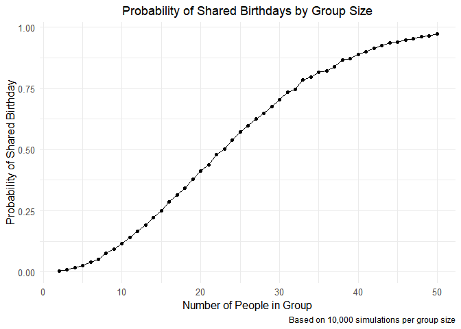
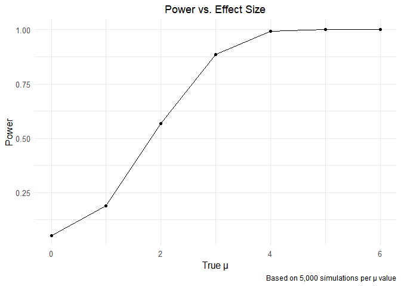
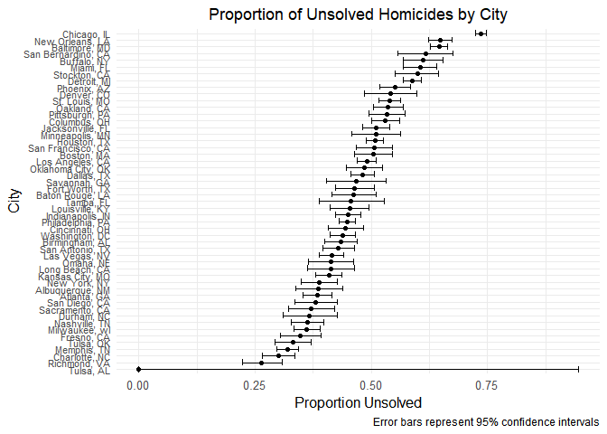

p8105_hw5_xs2569
================
XunSun
2024-11-15

``` r
library(tidyverse)
```

    ## ── Attaching core tidyverse packages ──────────────────────── tidyverse 2.0.0 ──
    ## ✔ dplyr     1.1.4     ✔ readr     2.1.5
    ## ✔ forcats   1.0.0     ✔ stringr   1.5.1
    ## ✔ ggplot2   3.5.1     ✔ tibble    3.2.1
    ## ✔ lubridate 1.9.3     ✔ tidyr     1.3.1
    ## ✔ purrr     1.0.2     
    ## ── Conflicts ────────────────────────────────────────── tidyverse_conflicts() ──
    ## ✖ dplyr::filter() masks stats::filter()
    ## ✖ dplyr::lag()    masks stats::lag()
    ## ℹ Use the conflicted package (<http://conflicted.r-lib.org/>) to force all conflicts to become errors

``` r
library(broom)
```

## Problelm 1 : Birthday Problem

``` r
# Function to check for shared birthdays in a group
check_birthdays = function(n) {
  birthdays = sample(1:365, n, replace = TRUE)
  any(duplicated(birthdays))
}

# Simulate for different group sizes
set.seed(1) # for reproducibility
results_df = tibble(
  group_size = 2:50,
  probability = map_dbl(2:50, function(n) {
    simulations = replicate(10000, check_birthdays(n))
    mean(simulations)
  })
)

# Create birthday probability plot
birthday_plot = ggplot(results_df, aes(x = group_size, y = probability)) +
  geom_line() +
  geom_point() +
  labs(
    title = "Probability of Shared Birthdays by Group Size",
    x = "Number of People in Group",
    y = "Probability of Shared Birthday",
    caption = "Based on 10,000 simulations per group size"
  ) +
  theme_minimal() +
  theme(
    plot.title = element_text(hjust = 0.5),
    axis.text = element_text(size = 10),
    axis.title = element_text(size = 12)
  )
print(birthday_plot)
```

<!-- --> \#
Problem 2: Power Analysis ————————————————

``` r
# Function to run one set of simulations for a given mu
run_power_sim = function(mu, n = 30, sigma = 5, nsim = 5000) {
  
  map_dfr(1:nsim, function(i) {
    # Generate sample
    data = rnorm(n, mean = mu, sd = sigma)
    
    # Perform t-test
    test_result = t.test(data, mu = 0) %>% 
      broom::tidy()
    
    # Return results
    tibble(
      mu = mu,
      estimate = test_result$estimate,
      p_value = test_result$p.value,
      rejected = p_value < 0.05
    )
  })
}

# Run simulations for different values of mu
set.seed(1)
all_results = map_dfr(c(0:6), ~run_power_sim(.x))

# Calculate power and average estimates
power_results = all_results %>%
  group_by(mu) %>%
  summarize(
    power = mean(rejected),
    avg_estimate = mean(estimate),
    avg_estimate_rejected = mean(estimate[rejected])
  )

# Create power plot
power_plot = ggplot(power_results, aes(x = mu)) +
  geom_line(aes(y = power)) +
  geom_point(aes(y = power)) +
  labs(
    title = "Power vs. Effect Size",
    x = "True μ",
    y = "Power",
    caption = "Based on 5,000 simulations per μ value"
  ) +
  theme_minimal() +
  theme(
    plot.title = element_text(hjust = 0.5),
    axis.text = element_text(size = 10),
    axis.title = element_text(size = 12)
  )
print(power_plot)
```

<!-- -->

``` r
# Create estimates plot
estimates_plot = ggplot(power_results, aes(x = mu)) +
  geom_line(aes(y = avg_estimate, color = "All Samples"), linewidth = 1) +
  geom_line(aes(y = avg_estimate_rejected, color = "Rejected Samples"), linewidth = 1) +
  geom_point(aes(y = avg_estimate, color = "All Samples")) +
  geom_point(aes(y = avg_estimate_rejected, color = "Rejected Samples")) +
  geom_abline(intercept = 0, slope = 1, linetype = "dashed", alpha = 0.5) +
  scale_color_manual(
    name = "Estimate Type",
    values = c("All Samples" = "blue", "Rejected Samples" = "red")
  ) +
  labs(
    title = "Average Estimates vs. True μ",
    x = "True μ",
    y = "Average Estimate",
    caption = "Based on 5,000 simulations per μ value"
  ) +
  theme_minimal() +
  theme(
    plot.title = element_text(hjust = 0.5),
    axis.text = element_text(size = 10),
    axis.title = element_text(size = 12),
    legend.position = "bottom"
  )
print(estimates_plot)
```

<!-- -->

# Problem 3: Homicide Analysis ——————————————–

There are 52179 observations and 12 varibles in the raw data. They are
uid, reported_date, victim_last, victim_first, victim_race, victim_age,
victim_sex, city, state, lat, lon and disposition.

``` r
# Read and clean the data
homicide_data = read_csv("./data/homicide-data.csv") %>%
  mutate(
    city_state = str_c(city, state, sep = ", "),
    solved = disposition != "Closed without arrest" & disposition != "Open/No arrest"
  )
```

    ## Rows: 52179 Columns: 12
    ## ── Column specification ────────────────────────────────────────────────────────
    ## Delimiter: ","
    ## chr (9): uid, victim_last, victim_first, victim_race, victim_age, victim_sex...
    ## dbl (3): reported_date, lat, lon
    ## 
    ## ℹ Use `spec()` to retrieve the full column specification for this data.
    ## ℹ Specify the column types or set `show_col_types = FALSE` to quiet this message.

``` r
# Summarize by city
city_summary = homicide_data %>%
  group_by(city_state) %>%
  summarize(
    total = n(),
    unsolved = sum(!solved)
  )

# Function to run prop.test for one city
run_prop_test = function(total, unsolved) {
  prop.test(unsolved, total) %>%
    broom::tidy() %>%
    select(estimate, conf.low, conf.high)
}

# Run prop.test for all cities
city_results = city_summary %>%
  mutate(
    test_results = map2(total, unsolved, run_prop_test)
  ) %>%
  unnest(test_results) %>%
  arrange(desc(estimate))
```

    ## Warning: There was 1 warning in `mutate()`.
    ## ℹ In argument: `test_results = map2(total, unsolved, run_prop_test)`.
    ## Caused by warning in `prop.test()`:
    ## ! Chi-squared近似算法有可能不准

``` r
# Create plot of proportions and CIs
proportion_plot = ggplot(city_results, aes(y = reorder(city_state, estimate), x = estimate)) +
  geom_point() +
  geom_errorbar(aes(xmin = conf.low, xmax = conf.high)) +
  labs(
    title = "Proportion of Unsolved Homicides by City",
    x = "Proportion Unsolved",
    y = "City",
    caption = "Error bars represent 95% confidence intervals"
  ) +
  theme_minimal() +
  theme(
    plot.title = element_text(hjust = 0.5),
    axis.text.y = element_text(size = 8),
    axis.text.x = element_text(size = 10),
    axis.title = element_text(size = 12)
  )
print(proportion_plot)
```

<!-- -->
